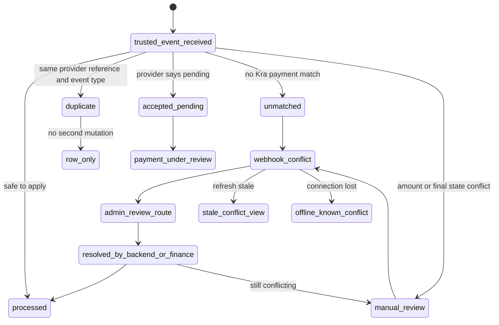

# Webhook Conflict State Spec

## Metadata
| Field | Value |
| --- | --- |
| State ID | `webhook_conflict` |
| Component family | Shared screen state |
| Primary component | `SharedWebhookConflictState` |
| Supporting components | `WebhookConflictStatusPanel`, `WebhookConflictEvidenceCard`, `WebhookConflictTimeline`, `WebhookProviderReferencePanel`, `WebhookConflictActions`, `WebhookConflictOwnerBadge`, `WebhookConflictPrivacyNotice`, `WebhookConflictRouteBridge`, `WebhookReplayUnavailableNotice` |
| Primary surfaces | admin web console, finance reconciliation, webhook event list, webhook event detail, launch readiness, support workflow, payment detail |
| Required recovery | route to admin review, webhook event detail, payment reconciliation, delivery detail, support escalation, backend escalation, or launch readiness blocker detail |
| Test id root | `state-webhook-conflict` |
| Backend coverage | `admin_webhook_events`, `ingest_mtn_momo_webhook`, `manual_review`, `unmatched`, `duplicate`, `accepted_pending`, `processed`, `WEBHOOK_SIGNATURE_INVALID`, `UNMATCHED_PROVIDER_REFERENCE`, `provider_amount_mismatch`, `conflicting_final_payment_status` |
| Browser mutation operation | None directly; this state must never call inbound provider webhook endpoints, internal workers, replay routines, payment mutation, refund mutation, or delivery release actions |
| Data sensitivity | provider reference, provider event ID, internal webhook event ID, payment ID, delivery ID, amount, provider event type, processing note, review owner, timing, support escalation context |
| Offline critical | No for mutation; yes for awareness because cached conflicts must remain visible and must keep risky actions blocked |
| Related inventory state | `webhook_conflict` |
| Related state specs | manual review required, payment under review, refund pending, blocked by payment, stale data, error, not authorized, session expired |
| Related modal specs | `ReplayWebhookModal`, `RefundDecisionModal`, `AuditSensitiveActionAckModal`, `EscalateIssueModal` |
| Design tokens | `webhook.red.700`, `webhook.amber.700`, `finance.blue.700`, `neutral.950`, `neutral.700`, `neutral.500`, `surface`, spacing `4-40`, radius `10-18`, motion `conflict-fade-140` |
| Accessibility target | WCAG 2.2 AA equivalent with non-color conflict markers, clear status language, announced refresh results, and predictable focus order |

## Purpose
`SharedWebhookConflictState` is the shared UI state shown when a trusted payment provider callback cannot be safely reconciled with Kra's known payment, delivery, or settlement state.

The state exists for trusted provider events that have already passed backend trust checks and have been persisted into the webhook event store. It does not represent untrusted requests, malformed requests, public tracking errors, sender payment retry errors, or generic backend failures.

The state must answer:

- Which trusted provider event is in conflict?
- Which Kra payment or delivery record is affected?
- Why is automatic processing unsafe?
- Who owns the next review?
- Which route should the user open next?
- Which actions are blocked until review is complete?
- What evidence can be safely shown without exposing raw provider payloads?

The most important rule is:

```text
A webhook conflict never releases payment, dispatch, refund, custody, or delivery state by itself.
```

## Product Job
Kra depends on mobile-money callbacks to decide whether money moved and whether service entitlement can progress. Provider callbacks can arrive late, arrive more than once, arrive out of the expected order, reference unknown records, or disagree with the internal payment state. The frontend must make that danger visible without giving operators unsafe controls.

The webhook conflict state must:

- show that the provider event is trusted but unresolved
- identify the conflict category
- show the provider event type and processing status
- show the matched Kra records when available
- show the review owner
- route finance to reconciliation
- route operations to delivery investigation when a delivery is matched
- route backend engineering to webhook processing evidence
- route support to safe customer communication
- keep transport, refund, and status mutation actions blocked
- protect raw payloads, signatures, credentials, full payer phone, provider secrets, and internal stack traces
- separate trusted conflicts from invalid signatures
- separate manual review from ordinary pending payment review
- separate provider conflict from rate limiting, session expiry, and authorization failure

## Strategic Role
Webhook conflict handling is a Tier 0 trust-control surface. It protects Kra from the most expensive payment failure modes:

- releasing a package before money is verified
- blocking a paid delivery because a provider event arrived in an unexpected sequence
- issuing a refund when provider settlement truth is unresolved
- hiding duplicate provider events that indicate integration instability
- losing finance accountability for unmatched provider references
- creating irreversible customer trust damage through careless payment state changes

The UI should feel like a financial control room, not a generic error panel. It must be compact, evidence-led, and conservative.

## Design Brief
Audience:

- Finance admins, super admins, platform operators, backend engineers, support leads, and QA reviewers.

Surface type:

- Shared operational state panel embedded in admin, reconciliation, launch readiness, support, and delivery investigation surfaces.

Primary action:

- Open the responsible admin review route.

Visual thesis:

- `Controlled red flag`: a high-contrast but calm evidence surface that shows the conflict, locks unsafe actions, and routes the right owner.

Restraint rule:

- Do not expose raw provider payloads, replay controls, payment overrides, refund approval, dispatch release, or provider secret material.

Density:

- Admin and finance views are evidence-rich. Support views are explanation-first and identifier-light. Launch readiness views are compact blocker summaries.

Platform stance:

- Desktop-first for admin and finance, mobile-safe for support and operations.

## External Research Used
Only directly relevant webhook, payment callback, and accessibility references were used:

- [Stripe webhooks](https://docs.stripe.com/webhooks): supports verifying webhook signatures, returning quick successful responses before complex processing, handling duplicate events, and designing for event delivery that can be retried or arrive out of order.
- [Paystack webhooks](https://paystack.com/docs/payments/webhooks/): supports acknowledging webhook events with `200 OK`, avoiding long-running synchronous webhook work, validating provider event origin, and expecting provider retries when acknowledgements fail.
- [GitHub webhook best practices](https://docs.github.com/en/webhooks/using-webhooks/best-practices-for-using-webhooks): supports responding quickly, processing payloads asynchronously, checking event type before processing, handling redelivery, and using delivery identifiers against replay risk.
- [WCAG 2.2 status messages](https://www.w3.org/WAI/WCAG22/Understanding/status-messages.html): supports announcing refresh, review, conflict, and processing-state changes without forcing focus movement.

## Local Sources
Local implementation and policy inputs:

- `docs/05-design/frontend-screen-inventory.md`
- `docs/07-api/webhooks-and-event-payloads.md`
- `docs/07-api/error-codes.md`
- `docs/07-api/api-contracts.md`
- `docs/09-payments/reconciliation-spec.md`
- `docs/09-payments/mtn-momo-flow.md`
- `docs/04-features/payments-spec.md`
- `docs/03-business/delivery-lifecycle.md`
- `docs/06-architecture/backend-architecture.md`
- `docs/14-platform/observability-and-alerting.md`
- `docs/15-qa/quality-strategy.md`
- `docs/05-design/design-system.md`
- `docs/05-design/copy-deck.md`
- `docs/05-design/frontend-screen-specs/admin-web-console/36-admin-webhook-events.md`
- `docs/05-design/frontend-screen-specs/admin-web-console/37-admin-webhook-event-detail.md`
- `docs/05-design/frontend-screen-specs/admin-web-console/24-admin-payment-reconciliation.md`
- `docs/05-design/frontend-screen-specs/admin-web-console/25-admin-payment-reconciliation-detail.md`
- `docs/05-design/frontend-screen-specs/shared-operational-modals/20-replay-webhook-modal.md`
- `docs/05-design/frontend-screen-specs/shared-screen-states/10-manual-review-required-state.md`
- `docs/05-design/frontend-screen-specs/shared-screen-states/16-payment-under-review-state.md`
- `docs/05-design/frontend-screen-specs/shared-screen-states/17-refund-pending-state.md`
- `packages/shared/src/contracts/api.ts`
- `services/api/src/payment-webhooks.ts`
- `services/api/src/payment-reconciliation.ts`
- `services/api/src/payments.ts`
- `services/api/src/app.ts`

## Backend Contract
Primary browser-safe read endpoint:

```http
GET /v1/admin/webhook-events
```

Browser-safe operation:

```text
admin_webhook_events
```

Inbound provider endpoint observed by admin surfaces:

```http
POST /v1/webhooks/payments/mtn-momo
```

Inbound provider operation:

```text
ingest_mtn_momo_webhook
```

Frontend rule:

```text
The frontend must never call POST /v1/webhooks/payments/mtn-momo.
```

Supported query:

```ts
{
  processingStatus?: "received" | "processed" | "duplicate" | "unmatched" | "accepted_pending" | "manual_review";
  limit?: number;
}
```

Supported webhook processing statuses:

```ts
type WebhookProcessingStatus =
  | "received"
  | "processed"
  | "duplicate"
  | "unmatched"
  | "accepted_pending"
  | "manual_review";
```

Supported event types:

```ts
type WebhookPaymentEventType =
  | "payment.pending"
  | "payment.confirmed"
  | "payment.failed";
```

Supported provider in v1:

```ts
type WebhookProvider = "mtn_momo";
```

Admin webhook event row:

```json
{
  "eventId": "EVT-WEB-4010",
  "provider": "mtn_momo",
  "providerEventId": "PROV-EVT-4010",
  "providerReference": "MTN-REF-4010",
  "eventType": "payment.failed",
  "amountGhs": 55,
  "currency": "GHS",
  "occurredAt": "2026-05-21T08:15:00.000Z",
  "receivedAt": "2026-05-21T08:15:03.000Z",
  "processingStatus": "manual_review",
  "matchedPaymentId": "PAY-4010",
  "matchedDeliveryId": "DEL-4010",
  "processingNotes": "conflicting_final_payment_status"
}
```

Current backend conflict notes:

```ts
type WebhookConflictProcessingNote =
  | "provider_amount_mismatch"
  | "conflicting_final_payment_status";
```

Current backend read limits:

- The list endpoint returns recent events only.
- The list endpoint supports filtering by processing status.
- The list endpoint supports `limit`.
- The list endpoint does not expose cursor pagination.
- The list endpoint does not expose server-side provider reference search.
- The list endpoint does not expose server-side payment ID search.
- The list endpoint does not expose server-side delivery ID search.
- The list endpoint does not expose raw payload reads.
- The list endpoint does not expose signature material.
- The list endpoint does not expose single-event read by ID.
- The browser backend does not expose replay.
- The browser backend does not expose manual webhook reprocessing.
- The browser backend does not expose payment status override from this state.
- The browser backend does not expose delivery release from this state.

## Inbound Processing Reality
Trusted inbound webhook processing follows these backend rules:

- Raw body is preserved server-side for verification.
- Provider signature is verified before the event is trusted.
- Invalid signatures return `401`.
- Invalid signatures are logged with `WEBHOOK_SIGNATURE_INVALID`.
- Trusted events are persisted before a `200` response is returned.
- Provider delivery is treated as at-least-once.
- Idempotency is based on `provider_reference + event_type`.
- A duplicate trusted event returns `200` with no second state mutation.
- An unmatched trusted event is persisted and acknowledged with `200`.
- An amount mismatch enters `manual_review` with `provider_amount_mismatch`.
- A final-state conflict enters `manual_review` with `conflicting_final_payment_status`.
- A pending provider event enters `accepted_pending`.
- A processed trusted event can update payment and delivery payment status when safe.

Frontend consequences:

- A trusted conflict is shown from stored records, not from live provider request handling.
- The UI must treat `manual_review` plus known conflict notes as the strongest signal.
- The UI must not show invalid signatures as trusted provider events.
- The UI must not reject or retry provider callbacks.
- The UI must not interpret `duplicate` as a second payment.
- The UI must not hide unmatched events because finance must review them.

## Canonical State Definition
Render `webhook_conflict` when the current surface is blocked or materially affected by a trusted provider webhook event that cannot safely mutate payment or delivery state without human or backend review.

Canonical triggers:

- `processingStatus="manual_review"` and `processingNotes="conflicting_final_payment_status"`.
- `processingStatus="manual_review"` and `processingNotes="provider_amount_mismatch"`.
- `processingStatus="unmatched"` when the host surface is about provider reference reconciliation.
- A launch readiness blocker reports manual-review webhook events.
- A payment reconciliation row indicates provider and internal truth conflict.
- A delivery detail knows the matched webhook event is under manual review.
- A support workflow is blocked because finance or backend must clear a provider event conflict.
- A refund review sees a provider event that disagrees with known payment or settlement state.

Do not render `webhook_conflict` for:

- invalid provider signature attempts
- ordinary payment pending review
- ordinary payment failed recovery
- ordinary payment confirmed state
- sender retry cooldown
- rate limiting
- session expiry
- unauthorized admin access
- offline fetch failure with no known conflict
- local validation error
- duplicate event with no known downstream risk
- generic manual review not caused by webhook evidence

## State Classification
Conflict severity must be derived from impact, not color alone.

### `critical_payment_state_conflict`
Use when a final provider event disagrees with a final internal payment state.

Examples:

- Provider says `payment.confirmed`; internal payment is `failed`.
- Provider says `payment.failed`; internal payment is `confirmed`.
- Provider sends a final event after refund workflow has started.
- Provider event would change delivery entitlement but backend refused automatic mutation.

Owner:

- Finance primary.
- Backend engineering secondary.
- Operations secondary when delivery movement is affected.

Primary action:

- `Open webhook review`.

Secondary actions:

- `Open reconciliation`.
- `Open delivery`.
- `Copy event ID`.

### `amount_mismatch_conflict`
Use when provider amount and Kra quoted amount disagree.

Examples:

- Provider amount is lower than quoted amount.
- Provider amount is higher than quoted amount.
- Provider amount has a currency mismatch if future providers introduce other currencies.

Owner:

- Finance primary.
- Backend engineering secondary if adapter normalization is suspect.

Primary action:

- `Open reconciliation`.

Secondary actions:

- `Open webhook event`.
- `Copy provider reference`.

### `unmatched_provider_reference`
Use when a trusted provider event cannot be matched to an internal payment or delivery record.

Examples:

- Provider reference is unknown to Kra.
- Provider reference belongs to a disabled provider adapter.
- Provider reference was never persisted due to earlier ingestion failure.
- Provider reference was typed or transformed incorrectly upstream.

Owner:

- Finance primary.
- Backend engineering secondary.

Primary action:

- `Open webhook review`.

Secondary actions:

- `Copy provider reference`.
- `Open reconciliation queue`.

### `launch_readiness_conflict`
Use when launch readiness is blocked by manual-review or unmatched webhook events.

Examples:

- Pilot readiness has unresolved webhook conflicts.
- Finance review target has been missed.
- Same provider has several unmatched events within 24 hours.
- A mismatch at or above the alert threshold exists.

Owner:

- Super admin primary.
- Finance primary for monetary review.
- Backend engineering primary for ingestion defects.

Primary action:

- `Open launch blocker`.

Secondary actions:

- `Open webhook events`.
- `Open finance queue`.

### `support_visible_conflict`
Use when support or operations can see that provider review blocks an answer, but cannot see sensitive webhook details.

Examples:

- Sender asks why payment has not cleared.
- Operations asks why dispatch remains blocked.
- Support needs safe language for a customer thread.

Owner:

- Support lead primary.
- Finance or backend as routed owner.

Primary action:

- `Open support guidance`.

Secondary actions:

- `Copy delivery ID`.
- `Escalate to finance`.

## Variant Matrix
| Variant | Trigger | Tone | Primary action | Secondary action | Blocked actions |
| --- | --- | --- | --- | --- | --- |
| `conflicting_final_payment_status` | `manual_review` plus final-state conflict note | severe, controlled | Open webhook review | Open reconciliation | release delivery, confirm payment, fail payment, refund |
| `provider_amount_mismatch` | `manual_review` plus amount mismatch note | severe, finance-led | Open reconciliation | Open webhook review | payment confirmation, dispatch, refund settlement |
| `unmatched_provider_reference` | trusted event has no matched payment | investigative | Open webhook review | Copy provider reference | payment mutation, delivery mutation |
| `launch_readiness_blocked` | readiness depends on unresolved webhook events | executive, concise | Open launch blocker | Open webhook events | launch approval |
| `support_visible` | role cannot view full provider evidence | calm, customer-safe | Open support guidance | Escalate | raw provider detail, finance mutation |
| `replay_unavailable` | user expects replay but backend has no browser-safe replay endpoint | policy-led | Open replay guidance | Contact backend | replay webhook |
| `stale_conflict_view` | conflict data is cached or generatedAt is stale | cautious | Refresh | Open last known record | mutation based on cached evidence |
| `offline_known_conflict` | known conflict is cached during offline state | conservative | Keep blocked | Retry connection | mutation, dismissal |

## Copy System
Copy must be specific enough for operators and calm enough for support.

### Voice Rules
- Say `trusted provider callback`, not `provider error`, when the event passed verification.
- Say `cannot be reconciled automatically`, not `broken`.
- Say `admin review required`, not `someone must fix this`.
- Say `payment and delivery actions stay blocked`, not `you cannot do anything`.
- Say `provider reference`, not `transaction number`, unless the host surface has already localized the term.
- Say `amount mismatch`, not `wrong amount`, because the UI may not know which side is wrong.
- Say `final state conflict`, not `bad callback`.
- Do not blame the sender, station, courier, or provider from this state alone.

### Primary Headline
Default:

```text
Webhook conflict needs review
```

For final-state conflict:

```text
Provider callback conflicts with Kra payment state
```

For amount mismatch:

```text
Provider amount does not match Kra payment record
```

For unmatched reference:

```text
Provider callback has no matching Kra payment
```

For launch readiness:

```text
Launch blocked by unresolved webhook conflicts
```

For support-visible:

```text
Payment provider review is blocking this delivery
```

### Body Copy
Default:

```text
A trusted provider event was stored, but Kra cannot safely apply it automatically. Finance or backend review must clear the conflict before payment, refund, or delivery actions continue.
```

Final-state conflict:

```text
The provider event reports a final payment result that does not match the current Kra payment state. Keep operational actions blocked until review confirms the correct source of truth.
```

Amount mismatch:

```text
The provider amount differs from the Kra payment amount. Finance must reconcile the charge before the delivery can move forward.
```

Unmatched reference:

```text
The provider event is trusted, but its reference does not match a Kra payment record. Finance review must identify whether money moved for an unknown or missing payment.
```

Support-visible:

```text
Kra has a trusted provider signal that needs admin review. Do not promise payment confirmation, refund, or delivery release until finance clears the record.
```

### Action Copy
Primary action labels:

- `Open webhook review`
- `Open reconciliation`
- `Open launch blocker`
- `Open support guidance`
- `Refresh status`

Secondary action labels:

- `Open delivery`
- `Open payment`
- `Copy event ID`
- `Copy provider reference`
- `Escalate to backend`
- `View replay guidance`

Forbidden action labels:

- `Approve payment`
- `Mark paid`
- `Mark failed`
- `Release delivery`
- `Retry provider callback`
- `Replay now`
- `Settle refund`
- `Ignore conflict`
- `Dismiss permanently`

## Information Architecture
The shared component must use five zones in this order:

1. Conflict summary.
2. Evidence card.
3. Impact lock.
4. Review route.
5. Privacy and audit note.

### Zone 1: Conflict Summary
Purpose:

- Identify the conflict quickly.

Required fields:

- headline
- short explanation
- severity
- current processing status
- review owner
- age since received

Layout:

- Admin desktop: left-aligned heading, severity badge, owner badge, status chip.
- Mobile: stacked heading, one-line owner, one-line age.
- Launch readiness: compact row with blocker count and oldest conflict age.

### Zone 2: Evidence Card
Purpose:

- Show the safe facts that justify the state.

Required fields:

- event ID
- provider
- provider event type
- provider reference
- amount and currency
- occurred time
- received time
- processing status
- processing note
- matched payment ID when available
- matched delivery ID when available

Optional fields:

- provider event ID
- review SLA
- generated-at timestamp
- duplicate relation if host can derive it
- reconciliation mismatch type if host has it

Never show:

- raw payload
- request headers
- signature value
- provider secret
- API key
- bearer token
- internal stack trace
- full payer phone
- full sender identity in support view

### Zone 3: Impact Lock
Purpose:

- Make blocked downstream actions explicit.

Possible locks:

- payment confirmation blocked
- payment failure blocked
- delivery dispatch blocked
- custody transfer blocked
- refund approval blocked
- refund settlement blocked
- launch approval blocked
- customer promise blocked

Copy:

```text
Payment and delivery actions stay blocked until this provider event is reviewed.
```

Support copy:

```text
Use review-safe language only. Do not promise payment confirmation or delivery release yet.
```

### Zone 4: Review Route
Purpose:

- Give the user one next route based on role and host.

Route priority:

1. Admin webhook event detail.
2. Payment reconciliation detail.
3. Delivery detail.
4. Launch readiness blocker.
5. Support escalation.
6. Backend escalation instruction.

Rules:

- If `eventId` is available and a detail route exists, use webhook detail as primary.
- If no detail route exists, use webhook list filtered by `manual_review` or `unmatched`.
- If `matchedPaymentId` exists and finance route exists, show reconciliation.
- If `matchedDeliveryId` exists and operations route exists, show delivery.
- If role lacks finance access, show support guidance instead of finance evidence.

### Zone 5: Privacy And Audit Note
Purpose:

- Explain why the UI is conservative and what is intentionally hidden.

Default copy:

```text
Raw provider payloads and signature material are hidden. Admin review uses the stored normalized webhook record and audit trail.
```

Support copy:

```text
Sensitive provider details are hidden from this view. Escalate with the delivery ID and event status only.
```

## Visual System
The component should be strong but not noisy.

### Layout
Desktop:

- Maximum width: `920px` inside content surfaces.
- Compact table row mode: `100%` width, no full panel chrome.
- Main panel: two-column grid after the summary.
- Left column: evidence.
- Right column: impact and actions.

Mobile:

- Single column.
- Summary first.
- Evidence in collapsible sections only when the host is not admin finance.
- Actions remain sticky only when screen height and host pattern support sticky safe actions.

Table row mode:

- Use compact severity stripe.
- Use one primary link.
- Keep the row readable without opening a detail drawer.

### Color
Use color as reinforcement only:

- Red for final-state conflict.
- Amber for unmatched or amount investigation.
- Blue for review owner and route.
- Neutral for identifiers and metadata.

Do not rely on color alone. Pair every color with:

- status text
- icon label
- badge text
- review owner

### Typography
Hierarchy:

- Heading: strong and short.
- Body: one or two lines.
- Evidence labels: compact uppercase or small label style.
- Values: tabular where numeric or ID-heavy.

Avoid:

- long paragraphs
- dramatic warning language
- all-caps headlines
- multiple competing badges

### Motion
Allowed motion:

- `conflict-fade-140` when state appears.
- subtle status chip transition when refresh changes state.
- no looping animation.

Reduced motion:

- disable transitions.
- preserve layout position.
- use static status changes.

### Icons
Allowed:

- warning triangle for conflict.
- link icon for review route.
- lock icon for blocked actions.
- shield icon for trusted verification.

Disallowed:

- money explosion visuals.
- sad faces.
- provider logos as status proof.
- animated warning indicators.

## Component API
Recommended TypeScript props:

```ts
type WebhookConflictVariant =
  | "conflicting_final_payment_status"
  | "provider_amount_mismatch"
  | "unmatched_provider_reference"
  | "launch_readiness_blocked"
  | "support_visible"
  | "replay_unavailable"
  | "stale_conflict_view"
  | "offline_known_conflict";

type WebhookConflictRoleScope =
  | "finance_admin"
  | "super_admin"
  | "operations_admin"
  | "support_lead"
  | "backend_engineer"
  | "qa_reviewer"
  | "readonly_admin";

type WebhookConflictRecord = {
  eventId: string;
  provider: "mtn_momo";
  providerEventId?: string;
  providerReference?: string;
  eventType: "payment.pending" | "payment.confirmed" | "payment.failed";
  amountGhs?: number;
  currency?: "GHS";
  occurredAt?: string;
  receivedAt?: string;
  processingStatus: "received" | "processed" | "duplicate" | "unmatched" | "accepted_pending" | "manual_review";
  processingNotes?: "provider_amount_mismatch" | "conflicting_final_payment_status" | string;
  matchedPaymentId?: string;
  matchedDeliveryId?: string;
  generatedAt?: string;
};

type WebhookConflictRoute = {
  label: string;
  href: string;
  kind:
    | "webhook_event"
    | "webhook_events"
    | "reconciliation"
    | "payment"
    | "delivery"
    | "launch_readiness"
    | "support"
    | "backend_escalation";
};

type SharedWebhookConflictStateProps = {
  variant: WebhookConflictVariant;
  roleScope: WebhookConflictRoleScope;
  record: WebhookConflictRecord;
  primaryRoute?: WebhookConflictRoute;
  secondaryRoutes?: WebhookConflictRoute[];
  blockedActions?: string[];
  isStale?: boolean;
  isOffline?: boolean;
  canCopyProviderReference?: boolean;
  canCopyEventId?: boolean;
  onRefresh?: () => void;
  onCopyEventId?: () => void;
  onCopyProviderReference?: () => void;
  onEscalate?: () => void;
};
```

Required defaults:

- `blockedActions` defaults to payment, delivery, refund, and launch actions based on host.
- `canCopyProviderReference` defaults to false unless role has finance or super admin scope.
- `canCopyEventId` defaults to true for admin scopes.
- `secondaryRoutes` defaults to empty.
- `isStale` defaults to false.
- `isOffline` defaults to false.

## Derivation Logic
Canonical derivation helper:

```ts
function deriveWebhookConflictVariant(record: WebhookConflictRecord): WebhookConflictVariant | null {
  if (record.processingStatus === "manual_review") {
    if (record.processingNotes === "conflicting_final_payment_status") {
      return "conflicting_final_payment_status";
    }

    if (record.processingNotes === "provider_amount_mismatch") {
      return "provider_amount_mismatch";
    }

    return "conflicting_final_payment_status";
  }

  if (record.processingStatus === "unmatched") {
    return "unmatched_provider_reference";
  }

  return null;
}
```

Host override:

- Launch readiness may derive `launch_readiness_blocked` from aggregate blocker data.
- Support may derive `support_visible` from a protected conflict record.
- Replay guidance may derive `replay_unavailable` when a user opens replay controls without a supported endpoint.
- Offline admin may derive `offline_known_conflict` when cached conflict evidence exists.

Do not derive this state from:

- `processingStatus="accepted_pending"` alone.
- `processingStatus="duplicate"` alone.
- `processingStatus="processed"` alone.
- `WEBHOOK_SIGNATURE_INVALID`.
- `RATE_LIMITED`.
- `FORBIDDEN`.
- `INTERNAL_ERROR`.
- `PAYMENT_REQUIRED`.

## Routing Rules
Route selection must be deterministic.

### Admin Webhook List Host
Primary route:

```text
/admin/webhook-events
```

Route intent:

- Filter or focus the current list to the conflict row.

Secondary routes:

- `/admin/finance/reconciliation`
- `/admin/deliveries/:deliveryId` when available

### Admin Webhook Detail Host
Primary route:

```text
/admin/webhook-events/:eventId
```

If single-event route is not implemented, the host may use:

```text
/admin/webhook-events?processingStatus=manual_review
```

or:

```text
/admin/webhook-events?processingStatus=unmatched
```

### Reconciliation Host
Primary route:

```text
/admin/finance/reconciliation/:paymentId
```

Fallback:

```text
/admin/finance/reconciliation
```

### Delivery Detail Host
Primary route:

```text
/admin/deliveries/:deliveryId
```

Secondary route:

```text
/admin/webhook-events
```

### Launch Readiness Host
Primary route:

```text
/admin/launch-readiness
```

Secondary route:

```text
/admin/webhook-events?processingStatus=manual_review
```

### Support Host
Primary route:

```text
/admin/support/deliveries/:deliveryId
```

Secondary route:

```text
/admin/webhook-events
```

Support-only role should not receive a deep link that exposes finance-only identifiers unless the route itself enforces the role boundary.

## Permissions
Read visibility:

- `finance_admin`: full normalized event evidence.
- `super_admin`: full normalized event evidence.
- `operations_admin`: delivery impact and matched delivery evidence, limited provider reference visibility.
- `support_lead`: customer-safe status and escalation route only.
- `backend_engineer`: normalized event evidence and backend escalation context where internal tooling allows it.
- `qa_reviewer`: non-production or redacted evidence only.
- `readonly_admin`: depends on host capability.

Copy permissions:

- Event ID can be copied by admin and backend roles.
- Provider reference can be copied by finance, super admin, and backend roles.
- Payment ID can be copied by finance and super admin roles.
- Delivery ID can be copied by operations, support, finance, and super admin roles.

Hidden for support:

- provider event ID
- full provider reference
- exact amount if not needed for customer message
- processing note string
- raw provider status details

Visible for support:

- safe status
- delivery ID
- review owner
- expected next route
- customer-safe explanation

## Privacy And Security
The component must never render:

- raw webhook payload
- request signature
- provider secret
- webhook signing secret
- authorization header
- bearer token
- API key
- raw request headers
- internal stack trace
- provider adapter error dump
- full payer phone
- customer personal details unrelated to the conflict

Masking rules:

- Provider reference: show full only to finance, super admin, and backend roles.
- Provider reference in support: show last 4 characters only.
- Payment ID: full in finance, shortened in support unless route already exposes it.
- Delivery ID: full in operational contexts.
- Amount: show to finance and admin; support may show generic amount context only if customer conversation requires it.

Audit rules:

- Copy actions should be analytics-tracked.
- Escalation actions should record route, role, event ID, and target owner.
- The state must not create a hidden mutation.
- The state must not silently clear itself after copy or navigation.

## Accessibility
Semantics:

- Wrap the state in a named region.
- Use a real heading.
- Use list semantics for blocked actions.
- Use table or definition-list semantics for evidence labels and values.
- Use `role="status"` for refresh completion when it does not move focus.
- Use `role="alert"` only for newly surfaced severe conflict messages that require immediate awareness.

Keyboard:

- Primary action appears before secondary actions in tab order.
- Copy actions must be reachable by keyboard.
- Collapsible evidence sections must expose `aria-expanded`.
- The route bridge must not trap focus.
- If opened in a modal, the host modal owns focus trapping.

Screen reader announcements:

- On first render: announce headline and review owner.
- On refresh success: announce whether the conflict remains or changed.
- On refresh failure: announce that last known conflict remains visible.
- On copy success: announce copied item type, not sensitive value.

Color and contrast:

- Minimum contrast for body text: 4.5:1.
- Minimum contrast for large text and badges: 3:1.
- Status chips include text labels.
- Icons include accessible names only when they convey unique meaning.

Touch target:

- Primary action minimum target: `44px` by `44px`.
- Copy buttons minimum target: `44px` by `44px` on mobile.
- Row compact mode must preserve keyboard focus visibility.

## Empty And Missing Data Behavior
Missing `providerReference`:

- Show `Provider reference unavailable`.
- Do not show copy provider reference action.
- Keep event ID visible.

Missing `matchedPaymentId`:

- Show `No matched payment`.
- Route to webhook review or reconciliation list.

Missing `matchedDeliveryId`:

- Show `No matched delivery`.
- Remove open delivery action.

Missing `amountGhs`:

- Show `Amount unavailable`.
- Keep conflict visible.

Missing `processingNotes` with `manual_review`:

- Show `Manual review required`.
- Use generic webhook conflict copy.
- Do not invent a conflict reason.

Missing `receivedAt`:

- Hide age chip.
- Show `Received time unavailable`.

Missing `generatedAt`:

- Hide generated-at timestamp.
- Do not mark stale unless the host has other stale evidence.

## Stale And Offline Behavior
Known conflict plus stale data:

- Keep state visible.
- Add `Last updated` timestamp.
- Show `Refresh status`.
- Disable mutation routes that depend on current status.
- Do not downgrade to generic stale state unless no conflict evidence remains.

Known conflict plus offline:

- Keep state visible.
- Show `Offline. Last known conflict remains active.`
- Disable refresh until connection returns.
- Keep copy event ID available if permitted.
- Keep primary review route available only if route can open cached detail.

Unknown conflict plus offline:

- Use `offline` or `stale_data`, not `webhook_conflict`.

Refresh result handling:

- If conflict remains, update timestamps and announce `Webhook conflict still needs review`.
- If conflict clears, host decides next state from latest payment, delivery, or reconciliation status.
- If refresh fails, keep last known conflict and show non-blocking fetch error.

## Host Integration
### Admin Webhook Events
Use as:

- row expansion for manual-review rows
- top summary when filter is `manual_review`
- empty-state replacement when no conflicts exist
- drawer content when list has limited detail

Do not use as:

- full raw event inspector
- replay control
- direct endpoint caller

### Admin Webhook Event Detail
Use as:

- hero status panel
- evidence lock
- route bridge to reconciliation or delivery
- replay unavailable explanation if user requests replay

Do not use as:

- editable provider payload form
- manual status override

### Admin Payment Reconciliation
Use as:

- mismatch explainer
- finance owner route
- provider reference card
- daily review blocker

Do not use as:

- general payment pending state
- failed payment retry state

### Launch Readiness
Use as:

- readiness blocker row
- critical drill-down card
- finance launch-blocker status

Do not use as:

- launch approval override
- aggregate chart by itself

### Support Workflow
Use as:

- customer-safe explanation
- escalation guide
- blocked promise warning

Do not use as:

- provider evidence dump
- finance detail exposure

### Delivery Detail
Use as:

- payment lock reason
- custody and dispatch blocker
- route to finance review

Do not use as:

- delivery exception reason when no payment provider conflict exists

## Decision Table
| Backend or host signal | Rendered state | Primary route | Notes |
| --- | --- | --- | --- |
| `manual_review` plus `conflicting_final_payment_status` | `webhook_conflict` | webhook review | strongest conflict state |
| `manual_review` plus `provider_amount_mismatch` | `webhook_conflict` | reconciliation | amount evidence leads |
| `unmatched` in webhook admin queue | `webhook_conflict` | webhook review | finance must review |
| `accepted_pending` | `payment_under_review` | payment status | not a conflict yet |
| `duplicate` with no downstream issue | normal list status | webhook row | not a shared blocker |
| invalid signature | security or error monitoring | none in shared state | never trusted event |
| `processed` | no conflict | payment or delivery route | already applied safely |
| reconciliation provider/internal mismatch | `webhook_conflict` or reconciliation mismatch state | reconciliation | use this when webhook evidence is central |
| launch readiness unresolved webhook count | `webhook_conflict` | launch blocker | show aggregate and oldest age |
| support lacks permission | `support_visible` | support guidance | redacted evidence |
| current session expired | `session_expired` | sign in | not this state |
| request throttled | `rate_limited` | retry after wait | not this state |

## State Machine


## Analytics
Events:

### `webhook_conflict_viewed`
Fire when the state first appears.

Properties:

- `surface`
- `variant`
- `role_scope`
- `processing_status`
- `processing_note_category`
- `provider`
- `event_type`
- `has_payment_id`
- `has_delivery_id`
- `age_bucket`
- `is_stale`
- `is_offline`

Do not send:

- raw provider reference
- raw provider event ID
- payer phone
- raw payload
- signature material

### `webhook_conflict_action_clicked`
Fire on primary or secondary route action.

Properties:

- `surface`
- `variant`
- `action_kind`
- `route_kind`
- `role_scope`
- `processing_status`
- `processing_note_category`

### `webhook_conflict_identifier_copied`
Fire on copy action.

Properties:

- `surface`
- `identifier_kind`
- `role_scope`
- `variant`

Never send copied value.

### `webhook_conflict_refresh_result`
Fire after refresh finishes.

Properties:

- `surface`
- `previous_variant`
- `next_state`
- `result`
- `latency_bucket`
- `is_stale_after_refresh`

Allowed `result` values:

- `still_conflicting`
- `cleared`
- `failed`
- `not_authorized`
- `session_expired`
- `rate_limited`

## Observability Requirements
Frontend logs:

- component rendered with variant
- missing route configuration
- missing event ID
- stale conflict shown
- redaction applied

Frontend logs must not include:

- provider reference
- raw payload
- signature
- token
- phone
- customer personal detail

Admin telemetry must help answer:

- Are admins opening the correct review route?
- Are users seeing stale conflicts often?
- Are support users blocked by missing escalation routes?
- Are manual-review conflicts aging beyond policy?
- Are launch readiness conflicts concentrated by provider?

## Error Mapping
### `UNMATCHED_PROVIDER_REFERENCE`
Map to:

- `webhook_conflict` when the host surface is webhook, reconciliation, launch readiness, or finance review.
- `manual_review_required` when no webhook-specific evidence is visible.

Copy:

```text
Verified provider event routed for manual review.
```

### `WEBHOOK_SIGNATURE_INVALID`
Map to:

- security monitoring or internal error log, not trusted `webhook_conflict`.

Copy for admin security surfaces:

```text
Provider callback trust validation failed.
```

### `RATE_LIMITED`
Map to:

- `rate_limited`.

Do not reuse `webhook_conflict`.

### `FORBIDDEN`
Map to:

- `not_authorized`.

Do not expose provider evidence.

### `INTERNAL_ERROR`
Map to:

- `api_error` unless a trusted stored conflict is already available.

If a trusted stored conflict is available:

- Keep `webhook_conflict`.
- Show refresh failure in a non-destructive inline status.

## QA Acceptance Criteria
Functional acceptance:

- Renders final-state conflict from `manual_review` plus `conflicting_final_payment_status`.
- Renders amount mismatch from `manual_review` plus `provider_amount_mismatch`.
- Renders unmatched provider reference from `unmatched`.
- Does not render for `accepted_pending`.
- Does not render for ordinary `duplicate`.
- Does not render for `processed`.
- Does not render for invalid signature attempts.
- Does not expose raw payload.
- Does not expose signature material.
- Does not expose provider secret fields.
- Does not show replay as available.
- Does not show payment override actions.
- Does not show delivery release actions.
- Redacts provider reference for support scope.
- Preserves full provider reference for finance scope when permitted.
- Routes finance users to reconciliation.
- Routes webhook users to webhook review.
- Routes support users to support guidance.
- Keeps known conflict visible when stale.
- Keeps known conflict visible when offline.
- Announces refresh result to assistive technology.

Visual acceptance:

- One dominant warning heading.
- No more than two high-priority badges.
- Evidence labels align cleanly.
- Mobile stacks without horizontal overflow.
- Table row mode remains compact.
- Color is not the only severity signal.
- Long IDs truncate with copy controls where allowed.
- Focus ring is visible on all actions.

Security acceptance:

- No raw provider payload in DOM.
- No signature value in DOM.
- No token in DOM.
- No unredacted provider reference for support scope.
- No analytics event sends sensitive values.
- No hidden browser call to provider webhook endpoint.
- No hidden browser call to replay endpoint.

## Test Plan
Unit tests:

- `deriveWebhookConflictVariant` returns final-state variant for `conflicting_final_payment_status`.
- `deriveWebhookConflictVariant` returns amount mismatch variant for `provider_amount_mismatch`.
- `deriveWebhookConflictVariant` returns unmatched variant for `unmatched`.
- `deriveWebhookConflictVariant` returns null for `accepted_pending`.
- `deriveWebhookConflictVariant` returns null for `processed`.
- `deriveWebhookConflictVariant` returns null for `duplicate`.
- Support redaction hides provider reference.
- Finance scope shows provider reference.
- Missing payment ID hides payment route.
- Missing delivery ID hides delivery route.
- Copy event ID fires analytics without copied value.
- Refresh failure keeps conflict visible.

Integration tests:

- Admin webhook list renders conflict row expansion.
- Reconciliation detail embeds amount mismatch state.
- Launch readiness renders webhook blocker.
- Support view renders redacted conflict.
- Stale refresh shows status message.
- Offline known conflict keeps actions blocked.
- Unauthorized role maps to not authorized.
- Session expiry maps to session expired.
- Rate limit maps to rate limited.

Accessibility tests:

- Heading exists.
- Region has accessible name.
- Refresh result is announced.
- Keyboard can reach primary route and copy actions.
- Copy success does not announce sensitive value.
- Collapsible evidence exposes expanded state.
- Focus order follows summary, evidence, impact, actions.
- Badge text is available without color.

Security tests:

- Render output does not contain raw payload fields.
- Render output does not contain signature fields.
- Render output does not contain authorization fields.
- Support render does not contain full provider reference.
- Analytics payload excludes sensitive identifiers.

## Content QA Checklist
Before closing implementation, verify:

- The headline identifies the exact conflict class.
- The body explains why automatic processing stopped.
- The primary action is a route, not a mutation.
- There is no replay button.
- There is no payment override button.
- There is no refund settlement button.
- There is no delivery release button.
- Provider reference is redacted by role.
- Event ID remains copyable where permitted.
- The state names the review owner.
- The state names blocked downstream actions.
- Stale and offline variants remain conservative.
- Support copy is customer-safe.

## Implementation Notes For Claude Code
Build this as a shared state component, not as a one-off card in one admin screen.

Recommended file shape:

```text
apps/web/src/components/states/SharedWebhookConflictState.tsx
apps/web/src/components/states/webhookConflictState.ts
apps/web/src/components/states/__tests__/SharedWebhookConflictState.test.tsx
```

If the repo uses a different app path, follow the existing shared-state component pattern.

Implementation rules:

- Keep derivation logic in a pure helper.
- Keep redaction logic in a pure helper.
- Keep route selection deterministic.
- Keep role scope explicit.
- Use existing design tokens.
- Use existing button, badge, alert, and route-link primitives.
- Do not introduce a new provider logo dependency.
- Do not fetch raw webhook payloads.
- Do not call inbound webhook endpoints.
- Do not call replay endpoints unless a future backend contract exists and this spec is updated.
- Do not mutate payment, delivery, refund, or launch readiness state.
- Do not hide conflict state just because refresh fails.

Suggested component boundaries:

- `SharedWebhookConflictState`: orchestration and layout.
- `WebhookConflictStatusPanel`: headline, severity, owner, age.
- `WebhookConflictEvidenceCard`: normalized event evidence.
- `WebhookProviderReferencePanel`: redacted provider reference and copy controls.
- `WebhookConflictTimeline`: occurred, received, reviewed, refreshed.
- `WebhookConflictActions`: route actions and copy actions.
- `WebhookConflictPrivacyNotice`: hidden-data explanation.
- `WebhookReplayUnavailableNotice`: shown only when host context asks about replay.

## Future Backend Dependencies
If product later enables admin webhook replay, this state must not be silently changed into a replay form. Add or confirm these backend contracts first:

- single webhook event read endpoint
- replay preflight endpoint
- replay submit endpoint
- replay result endpoint
- replay audit event
- replay permission separate from read permission
- idempotency key for replay requests
- conflict recheck after replay
- finance approval path for amount mismatch replay
- backend-owned replay queue

Until those exist, replay remains unavailable from the browser.

## Completion Standard
This spec is complete when a frontend engineer can build the `webhook_conflict` shared state end to end without asking:

- which backend fields drive the state
- which conflicts are canonical
- which conflicts are not this state
- what evidence to show
- what evidence to hide
- what routes to expose
- what actions are forbidden
- how support redaction works
- how stale and offline variants behave
- how accessibility status messages behave
- how analytics avoids sensitive data

The component is production-ready only when it preserves payment safety first, routes the right owner second, and explains the conflict third.
