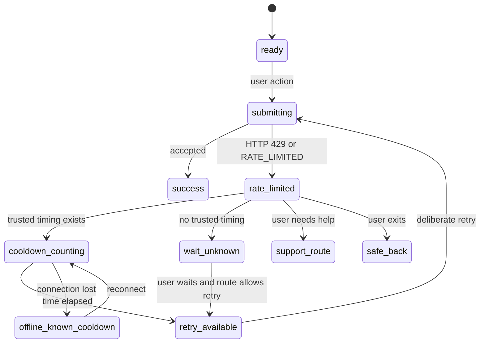

# Rate Limited State Spec

## Metadata
| Field | Value |
| --- | --- |
| State ID | `rate_limited` |
| Component family | Shared screen state |
| Primary component | `SharedRateLimitedState` |
| Supporting components | `RateLimitStatusPanel`, `RateLimitCountdown`, `RateLimitReasonCard`, `RateLimitSafeRetryActions`, `RateLimitPrivacyNotice`, `RateLimitRouteBridge`, `RateLimitSupportHint`, `RateLimitInlineNotice` |
| Primary surfaces | public web, receiver public flow, sender mobile app, operations mobile app, admin web console, shared auth flows, shared operational modals |
| Required recovery | show wait time when known, preserve user context, disable unsafe retry, provide safe retry after cooldown, route to support or alternate allowed flow |
| Test id root | `state-rate-limited` |
| Backend coverage | `ApiServiceError`, `apiErrorCodeSchema`, HTTP `429`, `RATE_LIMITED`, public tracking phone verification lock, mutation throttling, auth attempt throttling, resend cooldowns, export throttling, refresh throttling |
| Browser mutation operation | None directly; this state blocks repeated calls until server-authoritative cooldown allows a retry |
| Data sensitivity | request ID, operation name, retry timing, lock timing, tracking code context, masked phone, auth role hint, delivery ID, endpoint scope, attempt count category |
| Offline critical | Yes for field operations because retry timing must not create duplicate custody, proof, payment, or support commands |
| Related inventory state | `rate_limited` |
| Related state specs | error, loading, offline, stale data, not authorized, session expired, OTP required, proof required, payment under review, webhook conflict |
| Related modal specs | `VerifyOtpModal`, `ResolveIssueModal`, `EscalateIssueModal`, `RefundDecisionModal`, `RefundSettlementModal`, `StationValidationModal`, `ExportReportModal` |
| Design tokens | `rate.amber.700`, `rate.blue.700`, `rate.red.700`, `neutral.950`, `neutral.700`, `neutral.500`, `surface`, spacing `4-40`, radius `10-18`, motion `cooldown-fade-140` |
| Accessibility target | WCAG 2.2 AA equivalent with clear cooldown status, non-color wait indicators, careful live-region timing, visible focus, and reliable touch targets |

## Purpose
`SharedRateLimitedState` is the shared UI state shown when Kra or an upstream provider rejects an action because the user, device, session, IP, delivery, phone verification flow, or operation has made too many attempts in a protected time window.

The state is not a generic error. It is a controlled wait state. It must explain that retrying immediately is unsafe or unavailable, preserve the user's work where possible, show the trusted retry timing when available, and prevent accidental repeated submissions.

The state must answer:

- What action is temporarily limited?
- Is the limit protecting privacy, security, provider capacity, financial safety, or operational consistency?
- When can the user retry?
- Which context is still preserved?
- What can the user safely do instead?
- Which actions are disabled until the cooldown ends?
- Which details must stay hidden?

The most important rule is:

```text
Rate limiting must slow retries without leaking sensitive account, phone, delivery, or provider details.
```

## Product Job
Kra will operate across public tracking, mobile field operations, payments, station workflows, support, and admin tools. Some actions are naturally sensitive: OTP verification, sign-in, phone challenges, package scans, proof uploads, refund decisions, webhook review, report exports, and support creation.

The rate-limited state must:

- stop rapid repeat attempts
- prevent duplicate custody, proof, payment, and support side effects
- protect public receiver privacy
- protect account sign-in and recovery flows
- protect provider integrations from repeated calls
- preserve typed form data when safe
- keep already visible cached records stable
- show `lockUntil`, `retryAfterSeconds`, `retryAfterAt`, or equivalent server timing when available
- avoid pretending that client-side countdowns are authority
- let the user retry only after the trusted window has passed
- route urgent cases to support when policy allows
- route field users to alternate proof or recovery only when backend policy supports it
- keep internal attempt counts and security rules hidden from public users

## Strategic Role
Rate limiting is not only abuse prevention. For Kra, it is also operational damage control.

It protects:

- receiver identity verification from guessing attacks
- sign-in and recovery flows from enumeration
- payment and refund endpoints from duplicate attempts
- provider APIs from repeated requests
- field workflows from duplicate or out-of-order submissions
- admin exports from expensive repeated jobs
- support queues from duplicate case creation

The design must make the safe path obvious: wait, then retry once. It must not encourage users to hammer controls, refresh repeatedly, open multiple tabs, or switch to unsafe manual workarounds.

## Design Brief
Audience:

- Public receivers, senders, field operators, station staff, couriers, drivers, support staff, finance admins, super admins, and QA reviewers.

Surface type:

- Shared wait state used as a full-page state, inline form state, modal state, toast-adjacent notice, table action notice, and auth recovery panel.

Primary action:

- Wait until the trusted cooldown allows a safe retry.

Visual thesis:

- `Calm guarded pause`: a precise wait surface with one visible countdown, one safe recovery path, and no shame or blame.

Restraint rule:

- Do not reveal account existence, raw phone, OTP failure reasons, exact failed attempt policy, provider internals, hidden fraud rules, or bypass instructions.

Density:

- Public and auth flows are concise. Operations and admin flows include request ID, preserved context, and route-specific recovery.

Platform stance:

- Mobile-first for receiver and field operations. Desktop-ready for admin, support, and exports.

## External Research Used
Only directly relevant HTTP, security, and accessibility references were used:

- [RFC 6585 section 4](https://www.rfc-editor.org/rfc/rfc6585.html#section-4): defines HTTP `429 Too Many Requests` and allows response bodies to explain the condition and include retry timing guidance.
- [MDN HTTP 429](https://developer.mozilla.org/en-US/docs/Web/HTTP/Reference/Status/429): supports treating `429` as a client-rate limit response and using `Retry-After` when present.
- [OWASP Authentication Cheat Sheet](https://cheatsheetseries.owasp.org/cheatsheets/Authentication_Cheat_Sheet.html): supports login throttling and account-protection controls without leaking sensitive authentication detail.
- [WCAG 2.2 status messages](https://www.w3.org/WAI/WCAG22/Understanding/status-messages.html): supports accessible cooldown, refresh, retry-enabled, and lock status announcements without unnecessary focus movement.
- [WCAG 2.2 error identification](https://www.w3.org/WAI/WCAG22/Understanding/error-identification.html): supports clear identification of why an action cannot currently proceed.
- [WCAG 2.2 target size minimum](https://www.w3.org/WAI/WCAG22/Understanding/target-size-minimum.html): supports reliable retry, support, and alternate-action touch targets in field conditions.

## Local Sources
Local implementation and policy inputs:

- `docs/05-design/frontend-screen-inventory.md`
- `docs/07-api/error-codes.md`
- `docs/07-api/api-contracts.md`
- `docs/08-security/authentication-flows.md`
- `docs/08-security/authorization-rules.md`
- `docs/08-security/privacy-and-data-retention.md`
- `docs/11-analytics/events-tracking-plan.md`
- `docs/14-platform/observability-and-alerting.md`
- `docs/05-design/design-system.md`
- `docs/05-design/copy-deck.md`
- `docs/05-design/frontend-screen-specs/auth-and-account/01-role-selection.md`
- `docs/05-design/frontend-screen-specs/auth-and-account/06-account-locked.md`
- `docs/05-design/frontend-screen-specs/receiver-public-flow/02-receiver-phone-challenge.md`
- `docs/05-design/frontend-screen-specs/receiver-public-flow/03-receiver-otp-verify.md`
- `docs/05-design/frontend-screen-specs/shared-operational-modals/10-verify-otp-modal.md`
- `docs/05-design/frontend-screen-specs/operations-mobile-shared/06-ops-action-recovery.md`
- `docs/05-design/frontend-screen-specs/shared-screen-states/03-error-state.md`
- `docs/05-design/frontend-screen-specs/shared-screen-states/14-otp-required-state.md`
- `docs/05-design/frontend-screen-specs/shared-screen-states/15-proof-required-state.md`
- `packages/shared/src/contracts/api.ts`
- `services/api/src/service-errors.ts`
- `services/api/src/app.ts`
- `services/api/src/public-tracking-verification.ts`
- `services/api/src/__tests__/public-tracking-verification.test.ts`

## Backend Contract
Shared API error code:

```ts
type ApiErrorCode = "RATE_LIMITED";
```

Current shared API error response shape:

```ts
type ApiErrorResponse = {
  requestId: string;
  error: {
    code: "RATE_LIMITED";
    message: string;
    details: Record<string, unknown>;
  };
};
```

Current service error mapping:

```text
ApiServiceError("RATE_LIMITED") -> HTTP 429
```

Current public receiver verification lock detail:

```json
{
  "requestId": "REQ-5001",
  "error": {
    "code": "RATE_LIMITED",
    "message": "Phone verification is temporarily locked. Try again later.",
    "details": {
      "lockUntil": "2026-05-21T10:01:00.000Z"
    }
  }
}
```

Supported cooldown detail fields should be normalized by the client if present:

```ts
type RateLimitTimingInput = {
  retryAfterSeconds?: number;
  retryAfterAt?: string;
  lockUntil?: string;
  resetAt?: string;
  resendAvailableAt?: string;
};
```

Normalization priority:

1. `Retry-After` response header if the API client exposes it.
2. `details.lockUntil`.
3. `details.retryAfterAt`.
4. `details.resetAt`.
5. `details.resendAvailableAt`.
6. `details.retryAfterSeconds`.
7. route-level conservative default.

Frontend rule:

```text
The server or provider owns cooldown authority. The client countdown is only a display and enablement aid.
```

Current backend-specific known lock:

- Public phone verification locks after too many failed OTP attempts.
- Current service stores a `lockUntil` ISO timestamp in error details.
- Current public lock copy is intentionally generic.
- Current backend maps the service error to HTTP `429`.

## Canonical State Definition
Render `rate_limited` when the current request, form, mutation, route, modal, or screen is blocked by a throttling or cooldown response and the next safe user action is to wait before retrying.

Canonical triggers:

- API response has HTTP `429`.
- API response error code is `RATE_LIMITED`.
- Auth provider returns too-many-requests or equivalent safe throttling signal.
- Public OTP verification returns `RATE_LIMITED`.
- Phone challenge resend is blocked by a cooldown and no alternate immediate action is allowed.
- A mutation response says the operation is temporarily limited.
- An export or report action is delayed by backend throttling.
- A refresh operation is temporarily limited and current data remains visible.
- A provider gateway returns a rate-limit condition that Kra exposes through a customer-safe message.
- A route-specific cooldown time is known and must control retry enablement.

Do not render `rate_limited` for:

- session expiry
- missing auth
- missing permission
- generic network failure
- provider timeout without throttling
- provider unavailable without throttling
- validation errors
- wrong OTP before threshold
- expired OTP
- payment pending review
- webhook conflict
- refund pending
- issue lock
- station scope violation
- account disabled
- confirmed account lock with recovery workflow

When identity is trusted and the condition is an account restriction rather than a temporary request throttle, use account locked or not authorized flows instead.

## State Scope
The rate limit can apply at different scopes. The component must show the smallest accurate scope.

### `field_scope`
Only one field or input group is blocked.

Use for:

- OTP entry cooldown.
- Resend code cooldown.
- Phone challenge retry wait.

UI shape:

- Inline field notice.
- Disabled submit.
- Countdown near the affected control.

### `form_scope`
The whole form is blocked.

Use for:

- sign-in attempts
- recovery request
- issue creation attempt
- support submission attempt
- payment retry attempt

UI shape:

- form-level alert under heading.
- preserve entered data if safe.
- primary submit disabled until cooldown ends.

### `action_scope`
One action in an otherwise usable screen is blocked.

Use for:

- refresh
- export
- resend
- retry upload
- retry proof submit
- report generation

UI shape:

- inline notice by the action.
- current screen stays usable.
- only affected action is disabled.

### `route_scope`
The whole route cannot proceed.

Use for:

- public tracking lookup throttle
- auth route throttle
- protected data fetch throttle without usable cache

UI shape:

- centered state panel.
- safe back route.
- support option when policy allows.

### `session_scope`
The current session is temporarily limited across several operations.

Use for:

- provider-level throttling tied to session
- staff session recovery after repeated command retries

UI shape:

- persistent banner plus disabled affected actions.
- do not sign the user out unless auth policy says to.

## Variant Matrix
| Variant | Trigger | Scope | Primary action | Secondary action | Privacy stance |
| --- | --- | --- | --- | --- | --- |
| `public_lookup_rate_limited` | public tracking or receiver lookup throttled | route | Try again after wait | Contact support | do not confirm tracking code validity |
| `phone_challenge_cooldown` | challenge resend blocked until `resendAvailableAt` | field | Wait for resend | Continue if already received | show masked phone only |
| `otp_verification_locked` | OTP verify returns `RATE_LIMITED` with `lockUntil` | form | Wait and retry | Use support guidance | do not expose failure reason |
| `auth_attempts_limited` | sign-in or recovery attempts throttled | form | Try later | Account recovery or support | do not confirm account existence |
| `mutation_rate_limited` | command mutation returns `RATE_LIMITED` | action or form | Retry after wait | Save or exit safely | preserve data when safe |
| `refresh_rate_limited` | refresh request throttled | action | Wait before refresh | Keep current data | keep existing view visible |
| `export_rate_limited` | report export throttled | action | Retry export later | Keep filters | preserve report criteria |
| `provider_rate_limited` | upstream provider throttles Kra request | form or route | Try later | Alternate approved path | do not show provider internals |
| `unknown_retry_time` | rate limit without retry timing | form or route | Try later | Contact support | avoid invented countdown |
| `offline_known_cooldown` | user is offline while known cooldown remains | form or route | Reconnect and retry later | Keep context | do not clear cooldown |
| `field_ops_retry_limited` | field command retry is throttled | action | Wait and retry once | Queue only if allowed | prevent duplicate custody or proof |

## Copy System
Copy must be calm, specific, and privacy-safe.

### Voice Rules
- Say `Too many attempts`, not `you are blocked`.
- Say `wait before trying again`, not `try repeatedly`.
- Say `for privacy` only when public verification or auth context needs it.
- Say `this action is paused`, not `your account is paused`, unless backend confirms account restriction.
- Say `retry after the time shown`, not `retry now`.
- Say `contact support` only when support can actually help.
- Do not reveal exact failed attempt count on public or unauthenticated flows.
- Do not confirm whether an account, phone number, tracking code, or delivery exists.
- Do not blame the user.

### Default Headline
```text
Try again later
```

### Default Body
```text
This action had too many attempts in a short time. Wait before trying again.
```

### With Trusted Time
```text
You can try again after the time shown.
```

### Public Receiver OTP
```text
For privacy, verification is temporarily locked. Wait before trying again.
```

### Auth Flow
```text
For security, sign-in attempts are paused for a short time. Wait before trying again.
```

### Field Operation
```text
This action is paused to prevent duplicate delivery updates. Wait before retrying once.
```

### Admin Export
```text
This export is temporarily limited. Keep your filters and retry after the wait time.
```

### Unknown Retry Time
```text
This action is temporarily limited. Wait a short time before trying again.
```

### Support Hint
```text
If the delivery is urgent, contact support with the request ID.
```

### Forbidden Copy
Do not use:

- `Blocked`
- `Suspicious activity detected`
- `You failed too many times`
- `This phone is wrong`
- `This account exists`
- `This tracking code is invalid`
- `Bypass limit`
- `Keep trying`
- `Refresh until it works`

## Information Architecture
The shared component uses five zones:

1. Cooldown summary.
2. Trusted wait time.
3. Preserved context.
4. Safe recovery actions.
5. Privacy and support note.

### Zone 1: Cooldown Summary
Purpose:

- Tell the user what is paused.

Required fields:

- headline
- scope label
- safe reason
- affected operation

Examples:

- `Phone verification paused`
- `Sign-in attempts paused`
- `Export temporarily limited`
- `Retry paused for this delivery action`

### Zone 2: Trusted Wait Time
Purpose:

- Show the retry window when trusted data exists.

Possible inputs:

- `lockUntil`
- `retryAfterAt`
- `retryAfterSeconds`
- `resetAt`
- `resendAvailableAt`
- `Retry-After`

Display:

- absolute local time
- relative countdown
- no countdown when no trusted timing exists

Countdown behavior:

- update visually every second only in focused short flows such as OTP
- update every minute or with static copy in long admin waits
- do not send live-region announcements every second
- announce only when retry becomes available

### Zone 3: Preserved Context
Purpose:

- Reassure the user that safe work is not lost.

May show:

- masked phone
- delivery ID
- request ID
- operation name
- current filters
- current form draft status
- last successful refresh time

Must not show:

- OTP
- raw phone on public surfaces
- auth credential
- full tracking code when privacy policy forbids it
- sensitive provider reference
- hidden attempt count
- backend security rule

### Zone 4: Safe Recovery Actions
Purpose:

- Provide exactly what the user can safely do.

Action priority:

1. Disabled retry with countdown.
2. Enabled retry after cooldown.
3. Safe back route.
4. Alternate approved flow.
5. Support route.

Action labels:

- `Try again`
- `Try again after wait`
- `Back`
- `Use another proof method`
- `Contact support`
- `Keep current data`
- `Return to sign in`

Forbidden actions:

- `Retry now` while locked
- `Submit anyway`
- `Skip verification`
- `Release delivery`
- `Approve manually`
- `Confirm payment`
- `Force export`

### Zone 5: Privacy And Support Note
Purpose:

- Explain the conservative behavior without leaking policy.

Default:

```text
This wait protects the action from repeated attempts. Sensitive security details are hidden.
```

Receiver:

```text
This protects receiver privacy. We do not show whether a code, phone, or tracking detail was the reason.
```

Field:

```text
This protects package records from duplicate updates. Retry only after the wait time.
```

Admin:

```text
Use the request ID if you need to escalate this limit to support or engineering.
```

## Visual System
### Layout
Full-page route:

- max width `560px`
- centered vertically only if the route has no useful context
- otherwise place below preserved route heading

Inline form:

- place under form heading or affected field group
- keep within form width
- keep submit button visible but disabled

Modal:

- place as modal body state
- keep close action visible
- preserve focus inside modal

Table action:

- place as row-level inline notice
- do not replace the entire table

Banner:

- use only when the rest of the page remains usable
- avoid sticky banners unless the blocked action is persistent

### Color
Use:

- Amber for temporary wait.
- Blue for retry and support route.
- Red only when the rate limit protects a critical security or custody action.
- Neutral for timing metadata and preserved context.

Do not:

- make the state look like permanent account removal
- use red for every rate limit
- rely on a spinner as the only signal
- make countdown the only visible information

### Typography
Headline:

- short
- action-specific
- no blame

Body:

- one to two sentences
- privacy-safe
- direct recovery

Timer:

- tabular numerals
- clear units
- local time label if absolute time shown

### Motion
Allowed:

- fade in notice
- subtle countdown text update
- button enable transition when cooldown ends

Disallowed:

- shaking fields
- pulsing red alerts
- looping progress rings
- animation that suggests background retry is happening

Reduced motion:

- no transitions
- static countdown text
- button state changes immediately

## Timer Rules
Timing must never rely on client guesses when server timing is available.

### Server Timing Inputs
Use timing inputs in this order:

1. `Retry-After` header.
2. `lockUntil`.
3. `retryAfterAt`.
4. `resetAt`.
5. `resendAvailableAt`.
6. `retryAfterSeconds`.
7. conservative route default.

### Countdown Calculation
Rules:

- Parse server timestamp as UTC.
- Compare against client clock only for display.
- If client clock appears ahead, still respect disabled state until next server check or route policy allows retry.
- If timestamp is in the past, enable retry only after a fresh response or route-safe refresh confirms it.
- If no timing exists, do not invent a precise countdown.
- If a header and body disagree, prefer the stricter later time unless backend client policy says otherwise.

### Retry Enablement
Retry may become enabled when:

- cooldown time has passed and route permits local enablement
- a background revalidation confirms limit cleared
- user navigates back into flow after cooldown

Retry must remain disabled when:

- no trusted timing exists and route requires explicit refresh
- operation is financial, custody, proof, or admin-sensitive and stale status remains
- offline state prevents a safe server check
- session expired
- permission is missing

### Automatic Retry
Automatic retry is usually forbidden.

Allowed only for:

- low-risk background refresh
- read-only data fetch
- non-sensitive section retry

Never auto-retry:

- OTP verification
- sign-in
- payment
- refund
- package scan
- custody handoff
- proof submission
- delivery completion
- webhook replay
- admin override
- issue resolution

## Component API
Recommended TypeScript props:

```ts
type RateLimitedVariant =
  | "public_lookup_rate_limited"
  | "phone_challenge_cooldown"
  | "otp_verification_locked"
  | "auth_attempts_limited"
  | "mutation_rate_limited"
  | "refresh_rate_limited"
  | "export_rate_limited"
  | "provider_rate_limited"
  | "unknown_retry_time"
  | "offline_known_cooldown"
  | "field_ops_retry_limited";

type RateLimitScope =
  | "field"
  | "form"
  | "action"
  | "route"
  | "session";

type RateLimitTiming = {
  retryAfterSeconds?: number;
  retryAfterAt?: string;
  lockUntil?: string;
  resetAt?: string;
  resendAvailableAt?: string;
  source?: "header" | "body" | "route" | "provider";
};

type RateLimitContext = {
  operation: string;
  requestId?: string;
  deliveryId?: string;
  trackingCodeMasked?: string;
  maskedPhone?: string;
  roleHint?: string;
  lastSuccessfulRefreshAt?: string;
  preservedContextLabel?: string;
};

type RateLimitAction = {
  label: string;
  kind:
    | "retry"
    | "back"
    | "support"
    | "alternate_flow"
    | "keep_current_data"
    | "sign_in"
    | "refresh";
  disabled?: boolean;
  href?: string;
};

type SharedRateLimitedStateProps = {
  variant: RateLimitedVariant;
  scope: RateLimitScope;
  timing?: RateLimitTiming;
  context: RateLimitContext;
  primaryAction?: RateLimitAction;
  secondaryActions?: RateLimitAction[];
  canRetryAfterCooldown?: boolean;
  isOffline?: boolean;
  isStale?: boolean;
  preserveFormData?: boolean;
  onRetry?: () => void;
  onSupport?: () => void;
  onBack?: () => void;
};
```

Required defaults:

- `canRetryAfterCooldown` defaults to false for financial, custody, proof, and auth flows.
- `preserveFormData` defaults to true when form data is not sensitive.
- `secondaryActions` defaults to empty.
- `isOffline` defaults to false.
- `isStale` defaults to false.

## Derivation Logic
Canonical helper:

```ts
function isRateLimitedError(input: {
  httpStatus?: number;
  code?: string;
}): boolean {
  return input.httpStatus === 429 || input.code === "RATE_LIMITED";
}
```

Variant helper:

```ts
function deriveRateLimitedVariant(input: {
  operation: string;
  scope?: RateLimitScope;
  hasLockUntil?: boolean;
  hasResendAvailableAt?: boolean;
  isPublic?: boolean;
  isAuth?: boolean;
  isFieldOperation?: boolean;
  isExport?: boolean;
  isRefresh?: boolean;
  isProvider?: boolean;
}): RateLimitedVariant {
  if (input.operation === "verify_public_tracking_phone" && input.hasLockUntil) {
    return "otp_verification_locked";
  }

  if (input.hasResendAvailableAt) {
    return "phone_challenge_cooldown";
  }

  if (input.isAuth) {
    return "auth_attempts_limited";
  }

  if (input.isExport) {
    return "export_rate_limited";
  }

  if (input.isRefresh) {
    return "refresh_rate_limited";
  }

  if (input.isFieldOperation) {
    return "field_ops_retry_limited";
  }

  if (input.isProvider) {
    return "provider_rate_limited";
  }

  if (input.isPublic) {
    return "public_lookup_rate_limited";
  }

  return "mutation_rate_limited";
}
```

Do not derive from:

- `FORBIDDEN`
- `AUTH_REQUIRED`
- `PHONE_VERIFICATION_REQUIRED`
- `VALIDATION_ERROR`
- `INVALID_STATUS_TRANSITION`
- `PAYMENT_REQUIRED`
- `PACKAGE_SCAN_MISMATCH`
- `INTERNAL_ERROR`
- `PROVIDER_TIMEOUT`
- network offline alone

## Routing Rules
### Public Tracking Host
Primary:

- disabled `Try again` until cooldown clears.

Secondary:

- support route if public support is available.

Rules:

- Do not confirm whether tracking code is valid.
- Do not show internal delivery ID unless already visible in verified context.
- Do not reveal exact attempts.

### Receiver OTP Host
Primary:

- disabled `Verify code` until `lockUntil` clears.

Secondary:

- support guidance.
- back to phone entry only when allowed.

Rules:

- Do not clear entered phone automatically.
- Clear entered OTP if security policy requires it.
- Keep masked phone only.
- Do not expose failure reason.

### Auth Host
Primary:

- `Try later` or disabled sign-in submit.

Secondary:

- recovery route if policy allows.

Rules:

- Do not confirm account existence.
- Do not show exact failed attempts.
- Do not switch to account locked unless backend confirms trusted account state.

### Operations Host
Primary:

- disabled retry until safe.

Secondary:

- alternate proof method if allowed.
- action recovery route.
- support route.

Rules:

- Do not queue rate-limited final completion unless offline outbox policy explicitly allows it.
- Do not allow duplicate package scan or custody command.
- Preserve local form text where safe.

### Admin Host
Primary:

- retry after wait.

Secondary:

- keep current data.
- export later.
- support or engineering escalation.

Rules:

- Show request ID.
- Show operation name.
- Preserve filters.
- Do not expose provider internals unless the host is specifically an authorized integration admin surface.

## Permissions And Privacy
Public users may see:

- generic wait message
- masked phone if already provided
- retry time
- support route

Public users must not see:

- exact failed attempt count
- hidden failure reason
- account existence
- full phone
- internal delivery IDs before verification
- backend policy thresholds

Authenticated field users may see:

- affected delivery ID
- operation label
- cooldown time
- alternate proof options when allowed
- request ID if the app uses it for support

Authenticated field users must not see:

- provider internals
- hidden anti-abuse signals
- raw security policy

Admins may see:

- request ID
- operation key
- endpoint family
- cooldown source category
- rate-limit bucket category when documented

Admins must not see:

- secret provider thresholds
- credentials
- OTP values
- hidden fraud rules
- raw personally identifying values unrelated to their role

## Accessibility
Semantics:

- Use a named region for full-page or route state.
- Use a real heading.
- Use `role="status"` for cooldown updates when the state appears or retry becomes available.
- Avoid `role="alert"` for every countdown tick.
- Use `aria-disabled` and native disabled controls where appropriate.
- Link inline notices to affected controls with `aria-describedby`.

Countdown accessibility:

- Do not announce every second.
- Announce initial wait state.
- Announce when retry becomes available.
- If countdown is long, expose static time text instead of live ticking text.
- If countdown changes from unknown to known, announce the update once.

Keyboard:

- Disabled retry must not trap focus.
- Secondary actions must remain reachable.
- Support route must have visible focus.
- Modal host must preserve focus trap and return focus on close.
- Field-level notice must be reachable through the field relationship.

Touch:

- Primary and secondary actions minimum `44px` by `44px`.
- Countdown text must not be the only tap target.
- Avoid narrow resend links on mobile.

Visual:

- Use text labels with icon or badge.
- Do not rely on color alone.
- Preserve strong contrast.
- Keep timer readable at large text sizes.

## Offline And Stale Behavior
Known cooldown plus offline:

- Keep rate-limited state visible.
- Show `Offline. Retry after reconnecting and after the wait time.`
- Do not enable retry based only on elapsed client time if operation needs server authority.
- Preserve safe form context.

Unknown cooldown plus offline:

- Use offline state if no rate-limit response was received.
- Do not invent a cooldown.

Stale data plus refresh throttle:

- Keep current data visible.
- Show inline refresh-rate notice.
- Disable refresh button until wait ends.
- Do not replace the whole screen unless the route has no usable data.

Cooldown expires while offline:

- Show `Reconnect to retry safely`.
- Keep primary retry disabled for critical mutations.
- Allow back, support, and safe navigation.

## Interaction Rules
### Preserve User Work
Preserve:

- issue form text
- report filters
- payment phone entry when safe
- delivery search filters
- selected proof method
- support thread draft when safe

Clear:

- OTP value after lockout if security policy requires it
- password fields after auth rate limit if auth policy requires it
- one-time proof tokens that have expired

### Disable Unsafe Controls
Disable:

- affected submit
- affected resend
- affected refresh
- affected export
- affected retry

Do not disable:

- safe back navigation
- help route
- support route
- alternate proof method if allowed
- close modal

### Retry After Cooldown
When retry becomes available:

- change primary action label to `Try again`
- announce availability once
- keep prior context
- require deliberate user action for sensitive operations
- do not submit automatically

### Repeated Failure
If retry returns `RATE_LIMITED` again:

- update timing from latest response
- show a short inline note: `The wait time was extended.`
- do not accuse user
- do not clear preserved work unless policy requires it

## Error Mapping
| Backend signal | Preferred state | Notes |
| --- | --- | --- |
| HTTP `429` | `rate_limited` | normalize timing if available |
| `RATE_LIMITED` | `rate_limited` | primary shared code |
| `lockUntil` on OTP verification | `rate_limited` with `otp_verification_locked` | public privacy copy |
| `resendAvailableAt` without error | field cooldown variant | not necessarily an error |
| auth provider too many requests | `rate_limited` or account locked | account locked only with trusted identity state |
| provider throttle | `rate_limited` or provider unavailable | use rate-limited only when throttle is explicit |
| `PHONE_VERIFICATION_REQUIRED` | OTP required | not rate-limited |
| `FORBIDDEN` wrong OTP under threshold | OTP invalid | not rate-limited |
| `VALIDATION_ERROR` | validation error | not rate-limited |
| `INTERNAL_ERROR` | error | not rate-limited |
| offline | offline | unless known cooldown already exists |

## Surface Rules
### Receiver Public Flow
Use when:

- phone challenge resend is too soon
- OTP verification is locked
- public tracking lookup is throttled

Rules:

- Keep copy privacy-safe.
- Do not confirm whether delivery or phone exists.
- Use masked phone only after user already entered it.
- No exact attempt counts.
- No technical endpoint names.

### Sender Mobile App
Use when:

- payment retry is throttled
- support creation is throttled
- profile refresh is throttled
- issue creation is throttled

Rules:

- Preserve form values.
- Avoid duplicate payment attempts.
- Route to support only when useful.

### Operations Mobile App
Use when:

- scan retry is throttled
- proof upload retry is throttled
- action recovery retry is throttled
- support creation is throttled

Rules:

- Block duplicate operational mutations.
- Keep package context visible.
- Offer alternate proof only when allowed.
- Never turn rate limit into offline queue by default.

### Admin Web Console
Use when:

- export is throttled
- refresh is throttled
- batch action is throttled
- admin auth is throttled

Rules:

- Preserve filters.
- Show request ID when available.
- Keep current data visible.
- Use inline notices for action-specific throttle.

### Shared Modals
Use when:

- modal submit is throttled
- verification is locked
- settlement action is throttled
- escalation action is throttled

Rules:

- Keep modal open.
- Preserve safe inputs.
- Disable only the affected submit.
- Keep close action available.

## Decision Table
| Situation | State | Primary copy | Primary action |
| --- | --- | --- | --- |
| OTP verification has `lockUntil` | `rate_limited` | `For privacy, verification is temporarily locked.` | wait |
| Sign-in provider says too many requests | `rate_limited` | `For security, sign-in attempts are paused.` | try later |
| Public tracking lookup returns `429` | `rate_limited` | `Try again later.` | wait and retry |
| Resend code too soon | `rate_limited` inline cooldown | `You can request another code after the wait.` | resend later |
| Report export is throttled | `rate_limited` action notice | `This export is temporarily limited.` | retry export later |
| Refresh is throttled but data exists | `rate_limited` inline notice | `Refresh is temporarily limited.` | keep current data |
| Payment provider throttle | `rate_limited` or provider unavailable | `Payment service is limiting requests.` | try later |
| Courier completion retry throttled | `rate_limited` | `This action is paused to prevent duplicate delivery updates.` | retry once after wait |
| Rate limit without timing | `rate_limited` | `Wait a short time before trying again.` | try later |
| Offline after known rate limit | `rate_limited` plus offline note | `Reconnect to retry safely.` | reconnect |

## State Machine


## Analytics
Events:

### `rate_limited_viewed`
Fire when the state appears.

Properties:

- `surface`
- `variant`
- `scope`
- `operation`
- `has_retry_time`
- `retry_time_bucket`
- `role_hint`
- `is_offline`
- `is_stale`

Do not send:

- phone
- OTP
- tracking code
- provider reference
- account identifier
- exact attempt count
- hidden lock rule

### `rate_limited_retry_clicked`
Fire when user clicks retry.

Properties:

- `surface`
- `variant`
- `scope`
- `operation`
- `retry_allowed`
- `cooldown_elapsed`

### `rate_limited_support_clicked`
Fire when user opens support from the state.

Properties:

- `surface`
- `variant`
- `scope`
- `operation`
- `request_id_present`

### `rate_limited_cleared`
Fire when a retry succeeds or latest state is no longer rate-limited.

Properties:

- `surface`
- `variant`
- `operation`
- `resolution`

Allowed `resolution` values:

- `retry_success`
- `state_changed`
- `user_left_flow`
- `support_route`

## Observability Requirements
Frontend logs may include:

- operation key
- request ID
- response status
- variant
- scope
- retry timing source category
- route name

Frontend logs must not include:

- OTP
- password
- raw phone
- full tracking code in public context
- account existence signals
- exact hidden threshold
- provider secrets
- raw provider response

Dashboard questions:

- Which operations produce rate limits most often?
- Which public verification routes hit lockout?
- Are users retrying before cooldown ends?
- Are field actions being retried unsafely?
- Are support routes receiving rate-limit escalations?
- Are exports or admin refreshes being throttled too often?

## QA Acceptance Criteria
Functional acceptance:

- Renders when HTTP `429` is returned.
- Renders when API error code is `RATE_LIMITED`.
- Uses `lockUntil` for OTP cooldown when present.
- Uses `Retry-After` header when exposed by the API client.
- Does not invent precise time when no trusted timing exists.
- Disables affected retry during cooldown.
- Keeps safe secondary actions available.
- Preserves form data when safe.
- Clears OTP or password only when policy requires it.
- Does not reveal exact attempt counts on public flows.
- Does not confirm account existence on auth flows.
- Does not confirm tracking code validity on public lookup.
- Does not auto-submit sensitive retries.
- Keeps current data visible for refresh throttles.
- Shows offline-known-cooldown when user loses connection after a known limit.
- Maps `PHONE_VERIFICATION_REQUIRED` to OTP required, not rate-limited.
- Maps `FORBIDDEN` wrong OTP under threshold to OTP invalid, not rate-limited.

Visual acceptance:

- One dominant wait message.
- One visible countdown when trusted time exists.
- No red panic styling for ordinary waits.
- No spinner-only state.
- Mobile layout has no horizontal overflow.
- Touch targets are at least `44px` by `44px`.
- Disabled retry state is visually and semantically clear.
- Long request IDs wrap or truncate safely.

Accessibility acceptance:

- Full-page state has a heading.
- Field notice is linked to affected control.
- Countdown does not announce every second.
- Retry availability is announced once.
- Disabled retry does not trap focus.
- Support and back actions remain keyboard reachable.
- Color is not the only wait signal.

Security acceptance:

- Public flow does not reveal exact attempt count.
- Auth flow does not confirm account existence.
- OTP value does not appear in analytics.
- Raw phone does not appear in public analytics.
- Hidden threshold values are not shown.
- Sensitive provider details are not shown.

## Test Plan
Unit tests:

- `isRateLimitedError` returns true for HTTP `429`.
- `isRateLimitedError` returns true for `RATE_LIMITED`.
- `isRateLimitedError` returns false for `FORBIDDEN`.
- `isRateLimitedError` returns false for `PHONE_VERIFICATION_REQUIRED`.
- `deriveRateLimitedVariant` returns `otp_verification_locked` for public verification lock.
- `deriveRateLimitedVariant` returns `phone_challenge_cooldown` for resend cooldown.
- `deriveRateLimitedVariant` returns `auth_attempts_limited` for auth route.
- `deriveRateLimitedVariant` returns `export_rate_limited` for export.
- Timing normalization prefers stricter trusted time.
- Unknown timing does not create countdown.
- Public redaction hides attempt count.
- Auth redaction hides account existence.
- Analytics excludes sensitive values.

Integration tests:

- Receiver OTP lock renders privacy copy and disabled submit.
- Phone resend cooldown renders inline countdown.
- Public tracking lookup throttle renders route state.
- Sender payment retry throttle preserves entered phone when safe.
- Courier completion retry throttle blocks duplicate submit.
- Admin export throttle keeps filters visible.
- Refresh throttle keeps current data visible.
- Offline after known cooldown requires reconnect.
- Session expiry overrides rate-limited state when auth token expires.
- Not authorized overrides rate-limited state when permission is missing.

Accessibility tests:

- Initial state announced once.
- Retry availability announced once.
- Countdown does not flood live region.
- Field notice is connected by `aria-describedby`.
- Buttons meet target size.
- Keyboard order follows heading, timing, context, actions.

Security tests:

- Public render does not contain raw phone.
- Public render does not contain exact failed attempt count.
- Auth render does not contain account existence statement.
- Analytics payload excludes OTP, phone, tracking code, and threshold.

## Content QA Checklist
Before closing implementation, verify:

- The state names the paused action.
- The state uses wait language, not blame language.
- The retry timing is server-authoritative or clearly unknown.
- The retry button stays disabled until safe.
- Sensitive details are hidden.
- Form data preservation follows policy.
- Alternate actions are real and allowed.
- Support route is only shown when useful.
- Public copy does not reveal account, phone, or tracking validity.
- Field operations do not retry automatically.
- Finance and payment flows do not mutate from this state.
- Accessibility announcements are not noisy.

## Implementation Notes For Claude Code
Build this as a shared state component and small derivation utility, not as isolated copy inside every screen.

Recommended file shape:

```text
apps/web/src/components/states/SharedRateLimitedState.tsx
apps/web/src/components/states/rateLimitedState.ts
apps/web/src/components/states/__tests__/SharedRateLimitedState.test.tsx
```

If mobile and admin apps have separate primitives, keep the derivation utility in a shared package or duplicate only the view shell, not the state rules.

Implementation rules:

- Normalize rate-limit timing in one utility.
- Keep privacy copy variant-driven.
- Keep route-specific copy overrideable.
- Treat server timing as authority.
- Do not auto-submit sensitive retries.
- Preserve safe form data.
- Clear sensitive fields only when policy requires it.
- Do not reveal exact failed attempt counts in public or auth flows.
- Do not use rate-limited state for account disabled or session expired.
- Do not turn rate limits into generic errors.
- Do not introduce background retry loops for money, proof, custody, or auth.

Suggested component boundaries:

- `SharedRateLimitedState`: orchestration and layout.
- `RateLimitStatusPanel`: headline and reason.
- `RateLimitCountdown`: trusted wait timing.
- `RateLimitReasonCard`: scope and privacy-safe explanation.
- `RateLimitSafeRetryActions`: disabled/enabled retry plus safe secondary actions.
- `RateLimitPrivacyNotice`: hidden-detail explanation.
- `RateLimitInlineNotice`: action-level compact notice.

## Future Backend Dependencies
The current backend exposes `RATE_LIMITED` and `lockUntil` for public phone verification. For stronger cross-product consistency, future backend work should standardize:

- `Retry-After` header on all HTTP `429` responses.
- `details.retryAfterAt` or `details.retryAfterSeconds`.
- stable operation key in error details.
- stable throttle scope in error details.
- support-safe request ID on every response.
- route-specific maximum retry copy where needed.
- explicit whether retry may be locally enabled after time elapses.

Until those exist, the frontend must prefer known timing, use conservative copy when timing is unknown, and avoid precise countdowns from guesses.

## Completion Standard
This spec is complete when a frontend engineer can build the `rate_limited` shared state end to end without asking:

- when to render it
- which backend signals map to it
- which states should replace it
- how timing is normalized
- what copy to use by surface
- what actions are disabled
- what data is preserved
- what sensitive information is hidden
- how accessibility announcements work
- how analytics avoids sensitive values

The component is production-ready only when it slows unsafe retries, preserves safe context, and never leaks the protected reason behind the limit.
